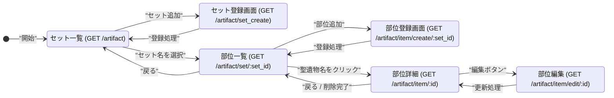

```mermaid
stateDiagram-v2
direction LR
    state "セット一覧 (GET /artifact)" as ART_SET
    state "セット登録画面 (GET /artifact/set_create)" as SET_NEW
    state "部位一覧 (GET /artifact/set/:set_id)" as ART_LIST
    state "部位登録画面 (GET /artifact/item/create/:set_id)" as ITEM_NEW
    state "部位詳細 (GET /artifact/item/:id)" as ITEM_DETAIL
    state "部位編集 (GET /artifact/item/edit/:id)" as ITEM_EDIT

    [*] --> ART_SET : "開始" 
    
    ART_SET --> SET_NEW : "セット追加" 
    SET_NEW --> ART_SET : "登録処理" 

    ART_SET --> ART_LIST : "セット名を選択" 
    
    ART_LIST --> ITEM_NEW : "部位追加" 
    ITEM_NEW --> ART_LIST : "登録処理" 

    ART_LIST --> ITEM_DETAIL : "聖遺物名をクリック" 
    ITEM_DETAIL --> ITEM_EDIT : "編集ボタン" 
    ITEM_EDIT --> ITEM_DETAIL : "更新処理" 
    
    %% ★ここを1本にまとめると、線が真っ直ぐになりやすいです
    ITEM_DETAIL --> ART_LIST : "戻る / 削除完了" 
    ART_LIST --> ART_SET : "戻る"
```

