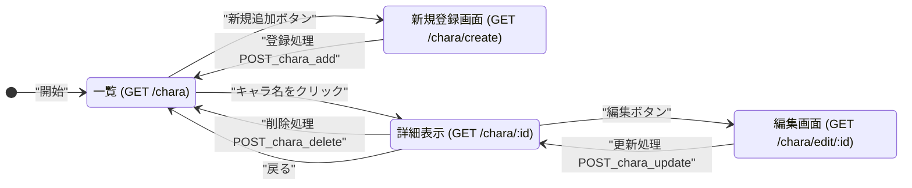

```mermaid
stateDiagram-v2
direction LR
    state "一覧 (GET /chara)" as C_LIST
    state "新規登録画面 (GET /chara/create)" as C_NEW
    state "詳細表示 (GET /chara/:id)" as C_DETAIL
    state "編集画面 (GET /chara/edit/:id)" as C_EDIT

    [*] --> C_LIST : "開始" 
    
    C_LIST --> C_NEW : "新規追加ボタン" 
    C_NEW --> C_LIST : "登録処理 POST_chara_add" 

    C_LIST --> C_DETAIL : "キャラ名をクリック" 
    C_DETAIL --> C_EDIT : "編集ボタン" 
    C_EDIT --> C_DETAIL : "更新処理 POST_chara_update" 
    
    C_DETAIL --> C_LIST : "削除処理 POST_chara_delete" 
    C_DETAIL --> C_LIST : "戻る" 
```