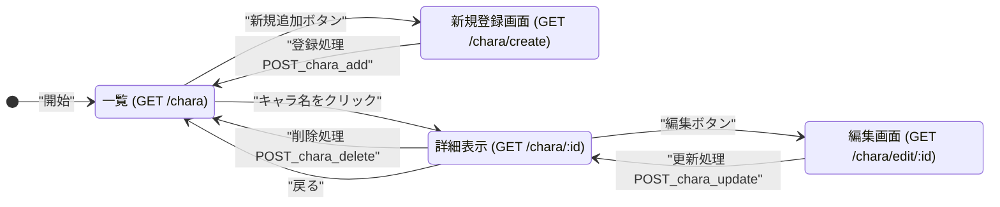
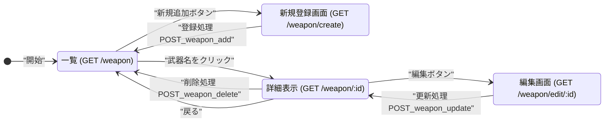
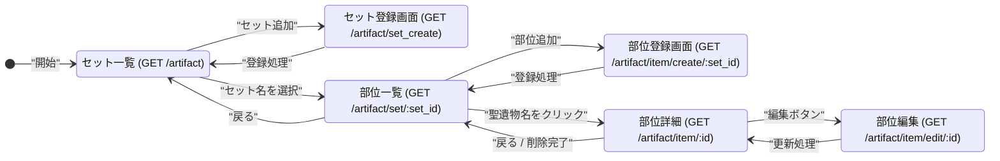

# 開発者用仕様書(仮)

## 概要
本システムは，ゲーム原神における「星5キャラクター所持数一覧」「星4・5武器所持数一覧」「スコア40以上の聖遺物一覧」を管理するシステムである．

## HTTPメソッドとリソース名一覧
### 星5キャラクター所持数一覧
| HTTPメソッド | リソース名                     | 機能概要               |
| ------------- | ------------------------------ | ---------------------- |
| GET           | /chara                   | 星5キャラクター一覧表示 |
| GET           | /chara/create                     | 星5キャラクター新規登録フォーム表示 |
| POST          | /chara_add                     | 星5キャラクター新規追加処理 |
| GET           | /chara/:id      | 星5キャラクター詳細表示 |
| GET           | /chara/edit/:id      | 星5キャラクター編集フォーム表示 |
| POST          | /chara/update/:id    | 星5キャラクター編集処理     |
| POST           | /chara/delete/:id      | 星5キャラクター削除処理     |

### 星4・5武器所持数一覧
| HTTPメソッド | リソース名                     | 機能概要               |
| ------------- | ------------------------------ | ---------------------- |
| GET           | /weapon                   | 星4・5武器一覧表示 |
| GET           | /weapon/create                     | 星4・5武器新規登録フォーム表示 |
| POST          | /weapon_add                     | 星4・5武器新規追加処理 |
| GET           | /weapon/:id      | 星4・5武器詳細表示 |
| GET           | /weapon/edit/:id      | 星4・5武器編集フォーム表示 |
| POST          | /weapon/update/:id    | 星4・5武器編集処理     |
| POST           | /weapon/delete/:id      | 星4・5武器削除処理     |
### スコア40以上の聖遺物一覧
#### 聖遺物セットの一覧表示
| HTTPメソッド | リソース名                     | 機能概要               |
| ------------- | ------------------------------ | ---------------------- |
| GET           | /artifact                   | 聖遺物セット一覧表示 |
| GET           | /artifact/set_create      | 新規追加聖遺物セットの名称の入力画面 |
| POST          | /artifact/set_add      | 聖遺物セット追加処理 |
| POST          | /artifact/set_delete/:set_id      | 聖遺物セット削除処理     |

#### 所持聖遺物の一覧表示
| HTTPメソッド | リソース名                     | 機能概要               |
| ------------- | ------------------------------ | ---------------------- |
| GET	|/artifact/set/:set_id | 聖遺物部位一覧表示
|GET	|/artifact/item/create/:set_id | 新規追加聖遺物部位の入力画面
POST	| /artifact/item_add | 聖遺物部位追加処理
GET	| /artifact/item/:id | 聖遺物詳細表示
GET	| /artifact/item/edit/:id | 聖遺物部位の編集画面
POST	|/artifact/item_update/:id | 聖遺物部位更新処理
POST	|/artifact/item_delete/:id | 聖遺物部位削除処理

## データ構造
本システムはリストを用いて，「管理番号」「該当キャラあるいは武器・聖遺物の名称」で管理する．更に，「該当キャラあるいは武器・聖遺物の名称」をクリックすると，対象の詳細情報を表示することができる．具体的なデータ構造は次に示す．ちなみに，聖遺物一覧に関しては，聖遺物セットデータと所持聖遺物データの2つのデータ構造を用いる．

### 星5キャラクター所持数一覧
- chara_id, 数値, 管理番号
- chara_name, 文字列, 該当キャラ名
- element, 文字列, 元素
- limited_chara, 文字列, 限定か恒常キャラかの可否(限定/恒常)
- levelbonus_name, 文字列, レベル突破ボーナス
- levelbonus_value, 数値, レベル突破ボーナスの値
- weapon_type, 文字列, 武器種
- level, 数値, レベル
- nomal_talent_level, 数値, 通常攻撃レベル
- skill_talent_level, 数値, 元素スキルレベル
- burst_talent_level, 数値, 元素爆発レベル
- role, 文字列, 役割(サポーター/サブアタッカー/メインアタッカー/ヒーラー)

### 星4・5武器所持数一覧
- weapon_id, 数値, 管理番号
- weapon_name, 文字列, 該当武器名
- weapon_type, 文字列, 武器種
- limited, 文字列, 限定か恒常武器かの可否(限定/恒常)
- rank_level, 数値, レアリティ(4または5)
- level, 数値, レベル
- base_attack, 数値, 基礎攻撃力
- sub_stat, 文字列, サブステータス項目
- sub_stat_value, 数値, サブステータス値
- passive_name, 文字列, 武器固有効果説明文
- refinement_level, 数値, 精錬ランク(1～5)
- motif, 文字列, 誰のモチーフ武器か(キャラ名)

### スコア40以上の聖遺物一覧
#### 聖遺物セットデータ
- artifact_set_id, 数値, 聖遺物セットID
- artifact_set_name, 文字列, 聖遺物セット名
- two_piece_effect, 文字列, 2セット効果(説明文)
- four_piece_effect, 文字列, 4セット効果(説明文)

#### 所持聖遺物データ
- artifact_id, 数値, 管理番号
- artifact_name, 文字列, 聖遺物名
- position, 文字列, 部位
- set_effect, 文字列, セット効果(説明文)
- main_stat, 文字列, メインステータス項目
- main_stat_value, 数値, メインステータス値
- sub_stat1, 文字列, サブステータス1項目
- sub_stat1_value, 数値, サブステータス1値
- sub_stat2, 文字列, サブステータス2項目
- sub_stat2_value, 数値, サブステータス2値
- sub_stat3, 文字列, サブステータス3項目
- sub_stat3_value, 数値, サブステータス3値
- sub_stat4, 文字列, サブステータス4項目
- sub_stat4_value, 数値, サブステータス4値
- score, 数値, スコア(会心率は2倍換算，元素熟知は0.25倍換算，その他は1倍換算で計算，攻撃力実数値・防御力実数値・HP実数値は換算対象外)

## ページ遷移
### 星5キャラクター所持数一覧のページ遷移図

### 星4・5武器所持数一覧のページ遷移図

### スコア40以上の聖遺物一覧のページ遷移図

