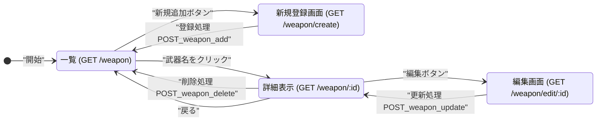

```mermaid
stateDiagram-v2
direction LR
    state "一覧 (GET /weapon)" as W_LIST
    state "新規登録画面 (GET /weapon/create)" as W_NEW
    state "詳細表示 (GET /weapon/:id)" as W_DETAIL
    state "編集画面 (GET /weapon/edit/:id)" as W_EDIT

    [*] --> W_LIST : "開始" 
    
    W_LIST --> W_NEW : "新規追加ボタン" 
    W_NEW --> W_LIST : "登録処理 POST_weapon_add" 

    W_LIST --> W_DETAIL : "武器名をクリック" 
    W_DETAIL --> W_EDIT : "編集ボタン" 
    W_EDIT --> W_DETAIL : "更新処理 POST_weapon_update" 
    
    W_DETAIL --> W_LIST : "削除処理 POST_weapon_delete" 
    W_DETAIL --> W_LIST : "戻る" 
```